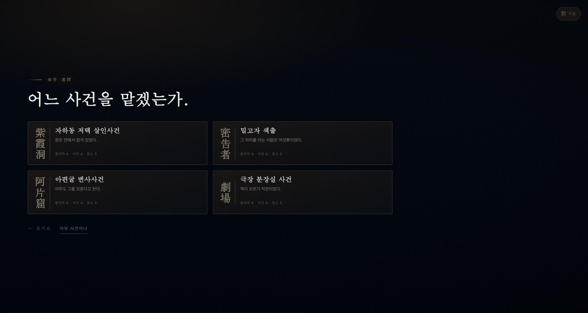
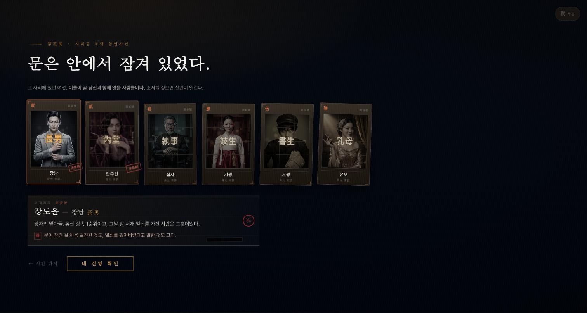
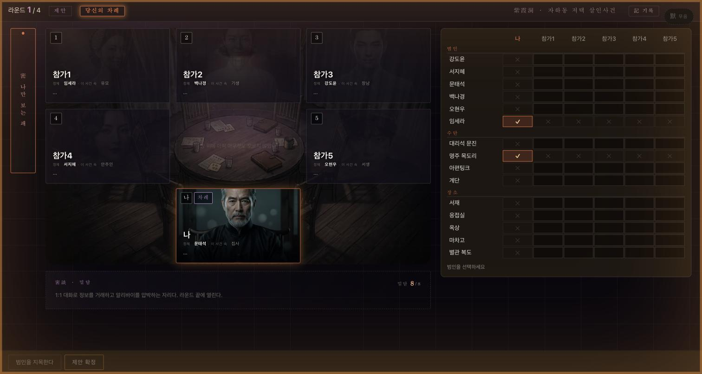
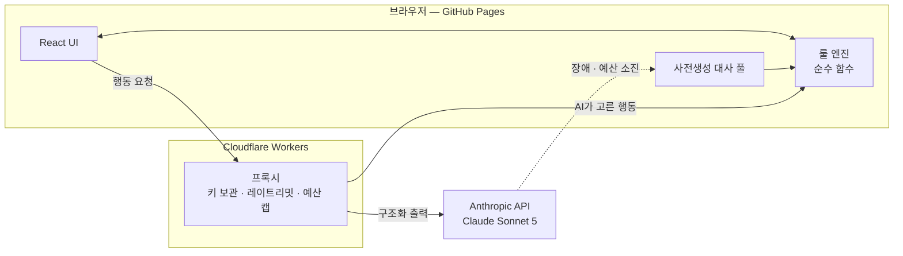

# 위증 (PERJURY)

> 클루의 추리 룰 위에서, LLM 에이전트 5명을 **거짓 반증과 1:1 밀담으로 교란·교섭**하는 싱글플레이 웹 추리게임.

**NAN 2026 — NHN Game × AI 해커톤 사전 과제**

### ▶ [지금 플레이하기](https://rhantj.github.io/perjury/)

설치도 로그인도 API 키도 필요 없다. 링크를 열면 바로 시작한다.


---

## 30초 요약

| | |
|---|---|
| **무엇** | 플레이어 1명 + LLM 에이전트 5명이 한 테이블에 앉는 싱글플레이 웹 추리게임 |
| **핵심** | 클루의 반증 규칙에 **"거짓말해도 된다"** 한 줄을 더했다. 정보 게임이 심리 게임이 된다 |
| **스택** | React 19 · TypeScript · Zustand · Vite / Cloudflare Workers / Claude Sonnet 5 |
| **규모** | 2인 · 10일 · 커밋 424개 · 테스트 564개 |
| **배포** | GitHub Pages 정적 호스팅. 푸시하면 자동 배포된다 |

---

## 화면

| 사건 고르기 | 여섯 명의 이력 |
|---|---|
|  |  |
| 시나리오 4종. 각각 용의자·수단·장소 구성이 다르다 | 각자 비밀과 동기가 있다. 시민도 감출 게 있다 |

| 내 진영과 손패 | 테이블과 추리표 |
|---|---|
|  |  |
| 직업 10종 중 하나가 배정된다. 능력이 판을 흔든다 | 왼쪽에서 제안하고, 오른쪽에 소거법을 적는다 |

---

## 왜 이 스택인가

배지를 나열하는 대신, 고른 이유를 적는다.

| 고른 것 | 이유 | 버린 것 |
|---|---|---|
| **GitHub Pages 정적 배포** | 심사자가 링크 클릭만으로 플레이해야 한다. 서버 프로세스를 둘 수 없다 | Vercel·Netlify (계정 의존), Electron·Unity (`.exe` 제출 불가) |
| **Cloudflare Workers 프록시** | 정적 호스팅에 API 키를 둘 수 없고 심사자에게 키를 요구할 수도 없다. 키 격리 + 레이트리밋 + 예산 캡을 한곳에서 한다 | 키를 프론트에 두기(유출), 심사자 BYOK(요건 위반) |
| **순수 TS 룰 엔진** | `상태 + 행동 → 새 상태`. LLM이 게임 상태를 직접 못 바꾼다. **AI가 룰을 어기는 게 구조적으로 불가능**하다 | LLM에 판정을 맡기기(환각이 곧 룰 위반) |
| **Zustand** | 화면 하나에 패널 전환뿐이라 라우터가 필요 없다. 스토어 1종으로 충분하다 | Redux(과함), Context(리렌더 범위 제어가 번거로움) |
| **CSS 변수 + 자체 컴포넌트** | 1935년 경성이라는 톤을 프레임워크 기본값으로는 못 낸다 | Tailwind·MUI (템플릿 냄새) |
| **Claude Sonnet 5** | 반증 판단 품질이 충분해 운영 모델로 정했다. 2026-08-03 실측 후 결정 (`docs/decisions/003-운영-llm-모델.md`) | Opus 5, Haiku |

---

## 구조



**LLM이 정하는 것은 "무엇을 할지"뿐이고, 그 행동은 반드시 룰 엔진을 통과한다.**
그래서 모델이 헛소리를 해도 게임 규칙은 깨지지 않는다.

개발과 배포는 경로가 갈린다. 로컬은 `localhost:8787`, 배포본은 `*.workers.dev`를 부른다
(`src/ai/proxy-url.ts`). **로컬에서 되는 것이 배포본에서 되는 것이 아니라서**, 동작 확인은 배포 링크에서 한다.

---

## 로컬 실행

```bash
git clone https://github.com/rhantj/perjury.git
cd perjury
npm install
npm run dev          # http://localhost:5173
```

API 키 없이도 돌아간다. LLM 호출이 실패하면 사전생성 대사로 넘어가므로 게임은 끝까지 진행된다.

```bash
npm run typecheck    # tsc --noEmit
npm test             # vitest — 564개
npm run build        # typecheck + vite build
```

---

## 팀원용 — 어느 문서를 언제 보는가

리포에 문서가 여러 개 있고 역할이 다르다. **위에서부터 순서대로 읽으면 된다.**

| 문서 | 무엇이 들어 있나 | 언제 보나 |
|---|---|---|
| [CLAUDE.md](CLAUDE.md) | 작업 규칙 — 절대 규칙 6개, TS/CSS 제약, 브랜치 명명, 푸시 절차, 세션 유지 | **코드를 쓰기 전에.** 여기 있는 규칙이 나머지 전부에 적용된다 |
| [docs/01-game-design.md](docs/01-game-design.md) | 게임 코어 — 룰, 라운드 구조, 직업 5종, AI 에이전트가 하는 일 | 게임 로직·콘텐츠를 건드릴 때 |
| [docs/02-tech-and-plan.md](docs/02-tech-and-plan.md) | 아키텍처, 스택 선택 이유, 2인 분업, 10일 일정, 리스크, 제출물 체크리스트 | 지금 뭘 해야 하는지 확인할 때 |
| [session-resume/](session-resume/) | 세션별 진행 스냅샷 — 어디까지 했고 **다음에 어디부터** 손대는지 | **작업을 시작할 때 최신 파일부터.** 이어받는 지점이 여기 있다 |
| `docs/decisions/` | 아키텍처·데이터 모델이 바뀐 이유 (한 파일 한 결정) | "왜 이렇게 돼 있지?" 싶을 때 |

### 문서를 나눈 기준

- **`docs/`는 영구 기록**이다. 룰·구조·결정처럼 판이 끝나도 유효한 것만 들어간다.
- **`session-resume/`는 그 시점 스냅샷**이다. 과거 파일은 고치지 않고 새로 쓴다. 로그지 문서가 아니다.
- **`CLAUDE.md`는 강제 규칙**이다. 설명이 아니라 지켜야 하는 것들이고, 어기면 배포나 심사에 영향이 간다.
- `local/`은 각자의 개인 공간이라 **gitignore되어 클론하면 없다.** 여기 있는 내용에 의존하는 작업을 만들지 않는다.

문서와 코드가 어긋나면 **문서를 먼저 고친다.** 코드가 문서를 앞서가면 다음 사람이 틀린 지도를 보게 된다.

---

## 이게 무슨 게임인가

6인 테이블에 앉는다. 당신 1명, AI 에이전트 5명.
사건의 진상은 **범인·흉기·장소** 세 장의 카드로 봉인되어 있고, 나머지 카드는 6명이 나눠 갖는다.

원래 클루라면 여기서 끝이다. 제안하고, 카드를 가진 사람이 반증하고, 소거법으로 정답을 좁힌다.
카드는 물리적으로 존재하므로 아무도 거짓말할 수 없다.

**이 게임은 거짓 반증을 허용한다.**

- 없는데 "있다"고 한다 → 상대의 추리를 오염시킨다
- 있는데 "없다"고 한다 → 진짜 정답인 것처럼 위장한다

그리고 거짓말은 **영구적인 부채**가 된다.
누군가 "서재 카드 있습니다"라고 했는데 내 손에도 서재 카드가 있다면 — 그는 거짓말쟁이로 확정된다.
즉 거짓말은 **언젠가 반드시 드러날 수 있는 형태로만** 가능하다.

시민이면 누가 위증하는지 추적해 정답을 특정하고, 범인이면 위증과 밀담으로 최종 고발을 틀리게 유도한다.

---

## 게임 규칙

아래는 **현재 코드가 실제로 하는 동작**이다. 설계 의도는 [docs/01-game-design.md](docs/01-game-design.md)에 있고,
여기 적힌 값과 흐름은 전부 엔진에서 확인한 것이다 (검증 방법은 맨 아래 [실측](#룰이-정말-그렇게-도는가--실측)).

### 구성물

| | 수 | 비고 |
|---|---|---|
| 카드 | **15장** = 범인 6 · 흉기 4 · 장소 5 | `src/engine/cards.ts` |
| 정답(봉인) | 종류별 1장씩 **3장** | 아무도 갖지 않는다 |
| 손패 | 나머지 **12장을 6명이 2장씩** | 겹치지 않는다 |
| 플레이어 | 사람 1 + AI 5 = **6명** | |
| 라운드 | **8** | D8 밸런싱에서 6으로 줄일 수 있다 |

카드 15장은 UI가 정한 제약이다. 추리표(15행 × 6열)에 스크롤이 생기면
"이 행은 아무도 못 냈다 → 정답 후보"라는 판단이 성립하지 않는다.

### 자리와 진영

진영은 따로 뽑지 않는다. **정답의 범인 카드를 배역으로 맡은 사람이 곧 범인이다.**

```
정답 범인 = 문태석  →  문태석 역을 맡은 자리가 범인, 나머지 5명이 시민
```

난수를 한 번 덜 쓰려는 게 아니라 이래야 클루의 추리가 그대로 성립한다.
**자기 배역 카드를 손에 쥔 사람은 결백이 증명된다** — 그 카드는 봉인되지 않았다는 뜻이므로.

범인은 항상 정확히 1명이고, 그게 당신일 확률은 **1/6**이다 (실측 16.9%).
범인은 시작할 때 정답 3장을 안다.

### 승리 조건

| 진영 | 이기는 조건 |
|---|---|
| 시민 | 최종 고발이 **3요소 모두** 정답 |
| 범인 | 최종 고발이 **하나라도** 틀림 |

**부분 정답은 없다.** 둘만 맞히면 범인 승리다 — 위장이 통했다는 뜻이기 때문이다.
(실측 2000판 중 1279판이 1~2개만 맞았고, 전부 범인 승으로 처리됐다.)

### 한 라운드

```
제안 → 반증 → 이의제기 → 밀담  ×8라운드  →  최종 고발
```

#### ① 제안 — 자리 순서대로 한 명

`범인 1 · 흉기 1 · 장소 1`을 고른다. 종류만 맞으면 되고, **자기가 가진 카드도 제안할 수 있다.**
소거를 위한 질문이지 주장이 아니기 때문이다.

제안권은 매 라운드 옆자리로 넘어간다. 8라운드 ÷ 6명이라 앞 두 자리가 한 번씩 더 제안한다.

```
p0 → p1 → p2 → p3 → p4 → p5 → p0 → p1
```

#### ② 반증 — 제안자 뺀 5명이 **동시에** 공개 선언

여기가 클루와 갈라지는 지점이다.

| | 클루 원본 | 위증 |
|---|---|---|
| 대상 | 제안자에게만 | **테이블 전체에 선언** |
| 방식 | 순서대로, 첫 반증자에서 멈춤 | **5명 전원 동시** |
| 실물 확인 | 카드를 보여준다 | **없다 — 말로만 한다** |

각자 둘 중 하나를 고른다.

- **"○○로 반증합니다"** — 제안된 3장 중 하나를 지목 (그 외 카드는 지목 불가)
- **"없습니다"** — 침묵

동시형이라 **"앞사람이 이미 반증해서 기회가 없었다"는 변명이 없다.**
그래서 "없습니다"도 하나의 진술이고, 거짓이면 똑같이 위증이다.

**위증 판정은 손패와 대조하면 끝난다** (`src/engine/round.ts`의 `isPerjury`).
LLM이 개입할 여지가 없고, 판정 결과는 아무에게도 보이지 않는다.

| 선언 | 위증인 경우 |
|---|---|
| "○○로 반증" | 그 카드가 손에 **없다** |
| "없습니다" | 제안된 3장 중 **하나라도 손에 있다** |

#### ③ 이의제기 — 잡을지 말지는 선택이다

발각을 엔진이 자동 공표하면 플레이어는 관전자가 된다. 그래서 잡는 행위를 결정으로 만든다.

**증명 수단은 하나뿐 — 내가 그 카드를 쥐고 있는 것이다.** 카드는 세상에 한 장뿐이므로
내 손에 있으면 상대는 가질 수 없다.

```
성공 (내가 그 카드 보유)   위증자의 손패 1장 무작위 공개  +  내 근거 카드 공개
실패 (내가 안 가짐)        내 손패 1장 무작위 공개
```

**잡는 쪽도 정보를 잃는다.** 성공해도 "내가 옥상을 갖고 있다"가 테이블에 공개된다.
그래서 알고도 숨기는 선택 — 밀담 협상 카드로 쥐고 있는 것 — 이 유효해진다.

제약 두 가지:

- **"없습니다" 선언은 이의제기 대상이 아니다.** "너는 그 카드를 갖고 있다"는 남의 손패를 볼 수 없으니 증명할 수 없다.
- **라운드당 이의제기는 1회.** 한 번 제기되면 그 라운드는 닫힌다. (`src/engine/challenge.ts` — D8 밸런싱 대상)

#### ④ 밀담 — 1:1 대화

라운드 끝에 열린다. 상대 하나를 골라 정보를 거래하거나 알리바이를 압박한다.
판당 **8회**로 제한된다 (`src/engine/parley.ts` · `src/components/Parley.tsx`).

### 최종 고발 — 진영에 따라 주체가 다르다

| 당신이 | 고발 주체 |
|---|---|
| 시민 | **당신** |
| 범인 | **AI 시민 5명의 합의** |

범인이 스스로 고발하면 게임이 성립하지 않는다. 정답을 아니까 일부러 틀리면 무조건 이긴다.
범인의 승리 조건이 "고발을 틀리게 **유도**"인 이유가 이것이다.

AI의 표는 **칸별 다수결**로 모은다. 조합 단위로 세면 5명이 1표씩 갈려 결정이 안 나기 때문이다.

```
범인 칸:  강도윤 3 · 문태석 2           → 강도윤
흉기 칸:  넥타이 2 · 수면제 2 · 계단 1   → 넥타이 (동률은 시드로)
장소 칸:  서재 4 · 옥상 1               → 서재
```

아무도 내지 않은 조합이 나올 수 있다. 집단 추리는 원래 그렇게 된다.
범인 입장에서는 **세 칸 중 하나만 오염시켜도 이긴다**는 뜻이다.

### 위증의 두 종류 — 성질이 정반대다

룰을 두 개 만든 게 아니라, **증명 가능성에서 저절로 갈라진 것**이다.

| | 없는데 "있다" | 있는데 "없다" |
|---|---|---|
| 목적 | 남의 추리표 오염 | 오답 조합을 정답처럼 위장 |
| 발각 | **즉시** — 그 카드 임자가 바로 안다 | **지연** — 나중에 모순이 생겨야 |
| 이의제기 | 걸린다 | **걸 수 없다** |
| 성격 | 공격적 | 방어적 |

### 규칙에서 저절로 따라오는 것 세 가지

1. **정답 카드로 한 위증은 원리적으로 잡히지 않는다.**
   봉인된 3장은 아무도 안 가졌으니 증명할 사람이 없다. 범인의 최강수다.
   실측 2000판에서 정답 카드 위증 **5913회 중 잡힌 건 0회**다. 버그가 아니라 룰의 논리적 귀결이고,
   너무 강하면 직업 능력(검시관) 쪽을 올려서 상쇄한다 — D8 감시 항목.

2. **거짓말은 즉시 이득이지만 영구 부채다.**
   "옥상으로 반증합니다"라고 한 순간, 옥상 카드 임자에게는 그가 거짓말쟁이로 **확정**된다.
   추측이 아니라 논리적 확정이다. 그래서 "안 들키게 거짓말하기"가 실제 과제가 된다.

3. **같은 시드는 항상 같은 판이다.**
   `Math.random()`을 쓰지 않는다. 이의제기 결과처럼 판 중간에 난수가 필요한 곳도
   상황에서 시드를 파생시켜(`${seed}:challenge:${round}:...`) 룰 엔진을 순수 함수로 유지한다.
   버그 재현과 밸런싱 실측이 여기에 얹힌다.

---

## AI 에이전트

5명의 AI는 각각 **자기만의 비공개 지식**만으로 판단한다. 전지적 정보를 갖지 않는다.
격리는 `src/engine/view.ts`의 `viewFor()` **한 곳**에서만 이뤄진다 — UI와 AI가 같은 함수를 쓴다.

| 항목 | 상태 |
|---|---|
| 손패 | 구현 — 자기 것만 |
| 진영 | 구현 — 범인이면 정답 3장을 안다 |
| 관측 기록 | 구현 — 공개 선언과 공개된 카드만 |
| 성격 (거짓말 성향·화법) | **미구현** — LLM 연동(D4) 이후 |
| 신뢰도 누적 | **미구현** — 밀담과 함께 들어간다 |

**남의 손패·남의 진영·위증 판정 결과는 뷰에 아예 담기지 않는다.**
`DeclarationView`에 `isPerjury` 필드가 없어서, 실수로 읽으려 하면 타입 에러가 난다.

지금 AI를 움직이는 것은 LLM이 아니라 규칙 기반 로직(`src/ai/rules.ts`)이다.
이것은 임시 구현이 아니라 **LLM이 죽었을 때의 폴백 경로**이기도 하다 — 그래서 먼저 만들었다.

---

## 룰이 정말 그렇게 도는가 — 실측

LLM 없이 판을 끝까지 돌리는 `autoPlay()`로 2000판을 자동 진행한 결과다.

| 항목 | 값 | 읽는 법 |
|---|---|---|
| 사람이 범인일 확률 | 16.9% | 설계값 1/6 = 16.7% |
| 판당 위증 | 3.57회 | 거짓말이 실제로 나온다 |
| 판당 이의제기 | 0.61회 | 잡는 쪽도 비용을 치르므로 아낀다 |
| 잡힌 위증 비율 | 17.2% | 나머지 82.8%는 그냥 지나간다 |
| 정답 카드 위증 | 5913회 → **0회 발각** | 원리적으로 증명 불가 |
| 시민 승률 | **3.4%** | ⚠️ 아래 참고 |

> **시민 승률 3.4%는 밸런싱이 안 된 상태다.** 규칙 AI가 모든 선언을 액면 그대로 믿어서
> 후보 목록이 위증으로 오염된 채 소거를 계속하기 때문이다.
> LLM 에이전트는 의심할 수 있으므로 이 수치가 아니다.
> **다만 폴백으로 내려가면 이 승률이 된다** — D8에 최소한의 의심 로직이 필요하다.

재현. 위 수치는 시드 `verify-0` ~ `verify-1999`를 이렇게 돌려서 뽑았다.

```ts
import { createGame } from './src/engine/setup'
import { autoPlay } from './src/ai/autoplay'

const end = autoPlay(createGame({ seed: 'verify-0' }))
end.outcome        // 승패 · 고발 · 정답
end.rounds         // 라운드별 선언(isPerjury 포함) · 이의제기 결과
```

`autoPlay`는 LLM을 한 번도 부르지 않으므로 **비용 0**이다. 밸런싱은 항상 여기서 먼저 본다.

```bash
npx vitest run   # 룰 엔진·AI·스토어 전체 (119개)
```

---

## 기술 개요

```
GitHub Pages (정적)  ──HTTPS──▶  Cloudflare Workers  ──▶  Anthropic API
  React + TypeScript                 (API 키 보관)
  순수 TS 룰 엔진                     (레이트리밋 · 예산 캡)
  사전생성 대사 폴백
```

- **룰 엔진은 순수 함수** — LLM이 게임 상태를 직접 바꿀 수 없다. 룰 위반이 구조적으로 불가능하다.
- **API 키는 리포에 없다** — Cloudflare Workers 환경변수에만 존재한다.
- **폴백 내장** — 프록시 장애·예산 소진 시 사전생성 대사로 게임이 계속 진행된다. 링크가 죽지 않는다.

---

## 상태

제출 완료 (2026-07-31 시작 / 2026-08-10 제출)

## 라이선스

[LICENSE](LICENSE) 참고. **코드는 MIT**, **게임 아트와 시나리오는 무단 사용 금지**다.
이미지는 팀이 프롬프트를 써서 생성한 것이고 시나리오는 창작물이라 재배포 범위를 열지 않았다.
